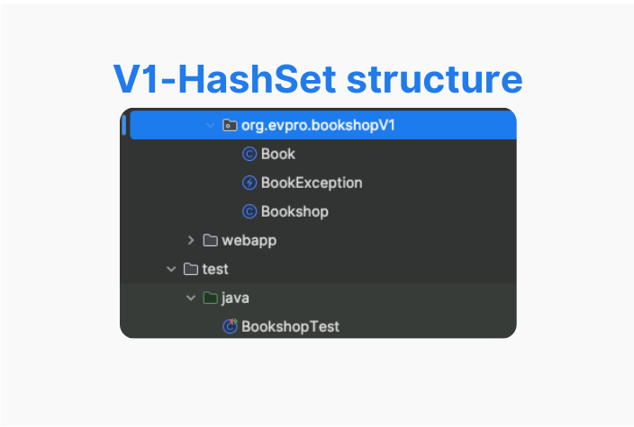
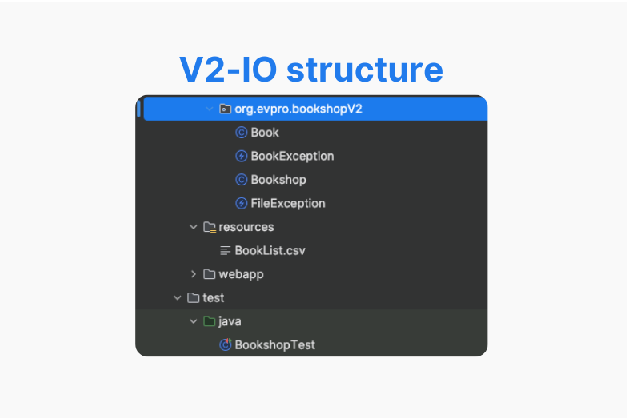
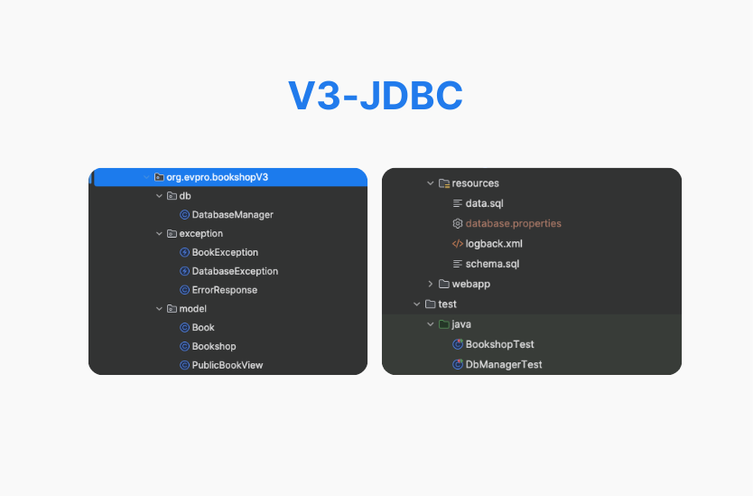
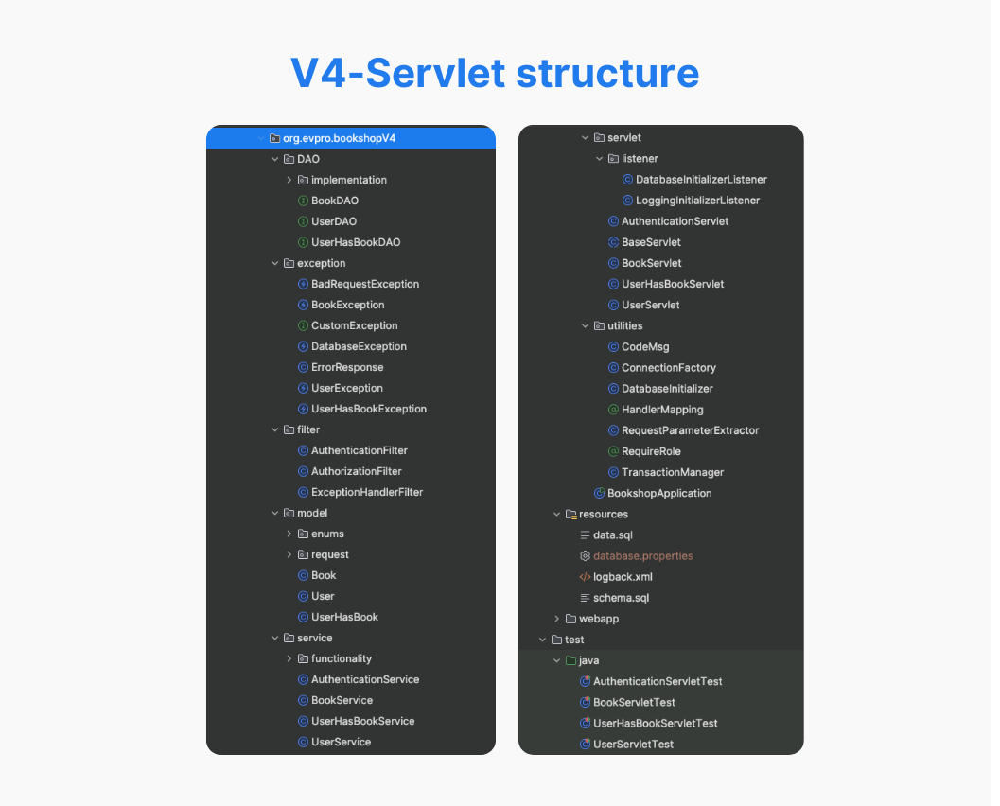

# 📚 Bookshop Evolution Project

[](https://www.oracle.com/java/technologies/javase/jdk17-archive-downloads.html)
[](LICENSE)

This project demonstrates the evolution of a Bookshop application through different implementations, each with a unique approach to data management and system architecture.

## 📋 Table of Content

1. [V1 - Basic management with HashSet](#v1---basic-management-with-hashset)
2. [V2 - Reading and writing to CSV file](#v2---reading-and-writing-to-csv-file)
3. [V3 - Database integration with JDBC](#v3---database-integration-with-jdbc)
4. [V4 - Servlet implementation and DAO pattern](#v4---servlet-implementation-and-dao-pattern)
5. [V5 - RESTful API with Spring Boot](#v5---restful-api-with-spring-boot)

### 🚀 Project evolution


## 🛠 Technologies Used
##### Backend:
- Java 17
- JDBC
- Servlets
- Apache Tomcat 9
- Spring Boot 3.3.1

##### Database:
- MySQL
- Hibernate

##### Testing: 
- JUnit 5
- Mockito


## Main Features

- Book catalog management
- User management
- Book lending system


## 🚀 Quick Start

```bash
git clone https://github.com/yourusername/bookshop-evolution.git
cd bookshop-evolution
git checkout v1-hashset  # or any other version you want to try
# Follow the README instructions in the specific branch
```

## Project Versions

### [V1 - Basic management with HashSet](https://github.com/saraobialero/Java17-ApacheTomcat-SpringBoot-Java_Evolution_Project/tree/v1-hashset)
Basic implementation of the bookshop using HashSet for in-memory data management.
 📸 

### [V2 - Reading and writing to CSV file](https://github.com/saraobialero/Java17-ApacheTomcat-SpringBoot-Java_Evolution_Project/tree/v2-io)
Evolution that introduces data persistence using CSV files.
📸 

### [V3 - Database integration with JDBC](https://github.com/saraobialero/Java17-ApacheTomcat-SpringBoot-Java_Evolution_Project/tree/v3-jdbc)
Implementation that uses JDBC for connection and data management with MySQL database.
📸 

### [V4 - Servlet implementation and DAO pattern](https://github.com/saraobialero/Java17-ApacheTomcat-SpringBoot-Java_Evolution_Project/tree/v4-servlet)
Introduction of the MVC pattern with Servlets and implementation of the DAO pattern for data access.
📸 

### [V5 - RESTful API with Spring Boot](https://github.com/saraobialero/Java17-ApacheTomcat-SpringBoot-Java_Evolution_Project/tree/v5-springboot)
(In development) Implementation of RESTful API using the Spring Boot framework.

## 📊 Comparison

| Feature          | V1: HashSet | V2: CSV | V3: JDBC | V4: Servlet | V5: Spring Boot |
|------------------|-------------|---------|----------|-------------|-----------------|
| Data Persistence |     ❌      |    ✅   |    ✅    |     ✅      |       ✅        |
| Web Interface    |     ❌      |    ❌   |    ❌    |     ✅      |       ✅        |
| API              |     ❌      |    ❌   |    ❌    |     ✅      |       ✅        |
| Scalability      |     Low     |   Low   | Moderate |   Moderate  |      High       |
| Complexity       |     Low     |   Low   | Moderate |    High     |    Moderate     |


## Testing

Each version includes a test suite to verify the correct functionality of the implemented features.

## 📚 Learning Outcomes

This project demonstrates:

- Evolution of a simple application into a full-fledged web service
- Different data persistence strategies
- Transition from monolithic to layered architecture
- Implementation of design patterns (DAO, MVC)
- Integration of frameworks and libraries
- Best practices in Java development across different paradigms

## Contributing

Contributions are welcome! Please read the contribution guidelines before getting started.