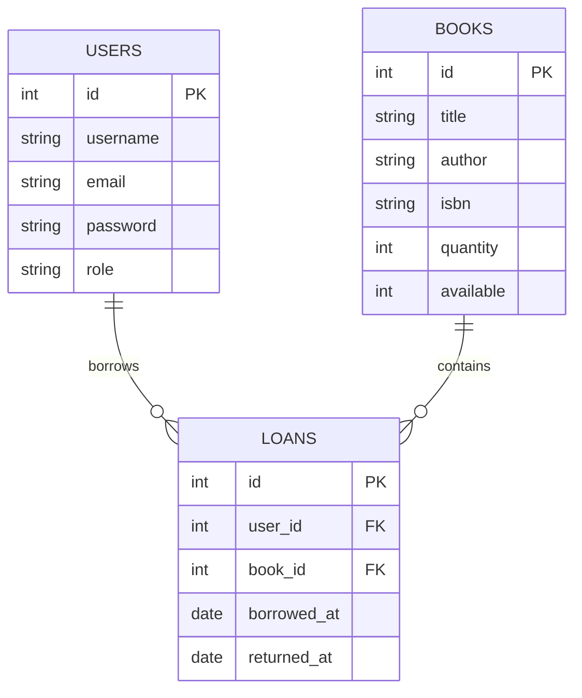

# 📚 Bookshop V4 - Servlet Implementation and DAO Pattern

This is the fourth version of the Bookshop project, which evolves into a web application using Servlets and the DAO (Data Access Object) pattern for better data management and separation of concerns.

## 📋 Table of Contents

1. [Project Overview](#project-overview)
2. [Features](#features)
3. [Technologies Used](#technologies-used)
4. [Project Structure](#project-structure)
5. [Prerequisites](#prerequisites)
6. [Setup](#setup)
7. [Authentication and Authorization](#authentication-and-authorization)
8. [Error Handling](#error-handling)
9. [Annotations](#annotations)
10. [API Endpoints](#api-endpoints)
11. [Testing](#testing)
12. [Key Improvements from V3](#key-improvements-from-v3)
13. [Limitations](#limitations)
14. [Future Improvements](#future-improvements)
15. [Contributing](#contributing)
16. [Notes](#notes)

---

## 📖 Project Overview

**Bookshop V4** builds on previous versions by introducing a web interface using **Servlets**, improved data access management with the **DAO pattern**, and enhanced security with **session-based authentication** and **role-based access control**.

---

## ✨ Features

- Web-based interface using **Servlets**
- **RESTful API** for CRUD operations on books, users, and loans
- **Session-based authentication** and **role-based authorization**
- Data access via **DAO pattern**
- Continued use of **JDBC** for database operations
- Global error handling with custom exceptions
- Integration with **Apache Tomcat** for running servlets

---

## 🛠 Technologies Used

| Category           | Technology                                                                                                                            |
|--------------------|--------------------------------------------------------------------------------------------------------------------------------------|
| **Language**       | [](https://www.oracle.com/java/technologies/javase/jdk17-archive-downloads.html) |
| **Servlet Container** | [](https://tomcat.apache.org/)                               |
| **Database**       | [](https://www.mysql.com/)                                                       |
| **JDBC**           | [](https://docs.oracle.com/javase/tutorial/jdbc/)                                 |
| **Build Tool**     | [](https://maven.apache.org/)                                             |
| **Testing**        | [](https://junit.org/junit5/)                                            |

---

## 📂 Project Structure

```
src/
├── main/
│   ├── java/org/evpro/bookshopV4/
│   │           ├── DAO/
│   │           │   └── implementation/
│   │           ├── exception/
│   │           ├── filter/
│   │           ├── model/
│   │           │   ├── requests/
│   │           │   └── enums/
│   │           ├──service/
│   │           │   ├── functionality/
│   │           ├── servlet/
│   │           │   ├── listener/
│   │           └── utilities/
│   ├── resources/
│   │   └── database.properties
│   └── webapp/
│       ├── WEB-INF/
│       │   └── web.xml
└──  test/java/
```
- **Servlets**: Handle HTTP requests and responses.
- **DAO Classes**: Manage database access for various entities (books, users, loans).
- **Filters**: Handle request preprocessing for authentication and authorization.
- **Models**: Represent the core entities in the system (books, users, loans).

---

## 💻 Prerequisites

- Java JDK 8 or higher
- Apache Tomcat 9 or similar servlet container
- MySQL Server
- Maven (for dependency management)

---

## 📊 ER Diagram

Below is the Entity-Relationship (ER) diagram for the Bookshop V4 database using Mermaid:



---

## ⚙️ Setup

1. **Create a MySQL database**:
   - Create a database called `bookshop_db_v4` and configure `database.properties`:
     ```
     db.url=jdbc:mysql://localhost:3306/bookshop_db_v4
     db.username=root
     db.password=yourpassword
     ```

2. **Deploy the WAR file** to your servlet container (e.g., Tomcat).


---

## 🔐 Authentication and Authorization
This application uses session-based authentication and role-based access control.

### Session Management
- User sessions are created upon successful login
- Session information is stored server-side
- Client receives a session ID stored in a cookie
- Sessions expire after 30 minutes of inactivity

### Filters
1. `AuthenticationFilter`: Ensures that requests to protected resources come from authenticated users
    - Checks for valid session
    - Redirects unauthenticated users to the login page

2. `AuthorizationFilter`: Controls access to resources based on user roles
    - Checks user role for admin-only resources
    - Returns 403 Forbidden if user doesn't have required role

### Role-Based Access Control
- Two main roles: USER and ADMIN
- Some endpoints are restricted to ADMIN role only (as indicated in the API Endpoints section)

---

## ⚠️ Error Handling

The application uses a global exception handling mechanism for consistent error responses.

### ExceptionHandlerFilter
- Catches all exceptions thrown during request processing
- Converts exceptions to appropriate HTTP status codes and error messages
- Ensures a consistent JSON error response format across the application

### Custom Exceptions
- `BookException`: For book-related errors
- `UserException`: For user-related errors
- `DatabaseException`: For database operation errors
- `BadRequestException`: For invalid request parameters

---

## 💡 Annotations

The application uses custom annotations for method mapping and role requirements.

### @HandlerMapping
- Used to map HTTP methods to servlet methods
- Example: `@HandlerMapping(path = "/book/filter", method = "GET")`

### @RequireRole
- Used to specify required role for accessing a method
- Example: `@RequireRole("ADMIN")`

Usage example:
```java
@RequireRole("ADMIN")
@HandlerMapping(path = "/book/update", method = "PUT")
public void handleUpdateOfBook(HttpServletRequest request, HttpServletResponse response) throws IOException {
    // Method implementation
} 
```

---
## 🛣️API Endpoints

- `/authentication/*`: User login and registration
- `/books/*`: Book management operations
- `/users/*`: User management operations
- `/loans/*`: Book lending operations

### Authentication
- `POST /authentication/login`: User login
- `POST /authentication/signup`: User registration
- `POST /authentication/logout`: User logout

### Books
- `GET /books/book/filter`: Get a book by ID, ISBN, or title
- `GET /books/filter/available`: Get all available books
- `GET /books/filter/author`: Get books by author
- `GET /books/filter/year_publication`: Get books by publication year range
- `GET /books/all`: Get all books
- `PUT /books/book/update`: Update a book (Admin only)
- `PUT /books/book/update/availability`: Update book availability (Admin only)
- `PUT /books/increase-quantity`: Increase book quantity (Admin only)
- `PUT /books/decrease-quantity`: Decrease book quantity (Admin only)
- `POST /books/add`: Add a new book (Admin only)
- `POST /books/add-multiple`: Add multiple books (Admin only)
- `DELETE /books/book/delete`: Delete a book (Admin only)
- `DELETE /books/delete/all`: Delete all books (Admin only)

### Users
- `POST /users/user/add`: Add a new user (Admin only)
- `GET /users/user/filter`: Get a user by ID or email (Admin only)
- `GET /users/filter/role`: Get users by role (Admin only)
- `GET /users/all`: Get all users (Admin only)
- `PUT /users/user/update/role`: Update user role (Admin only)
- `PUT /users/user/update`: Update user information (Admin only)
- `PUT /users/user/update/info`: Update user personal information (User)
- `DELETE /users/user/delete`: Delete a user (Admin only)
- `DELETE /users/delete/all`: Delete all users (Admin only)

### Loans (UserHasBook)
- `POST /loans/borrow`: Borrow a book
- `GET /loans/borrow/user`: Get all loans for a user
- `GET /loans/borrow/book`: Get all loans for a book (Admin only)
- `PUT /loans/borrow/return`: Return a borrowed book (Admin only)

---

## Testing

The `test` directory contains unit tests for services, DAOs, and servlets. Run tests using:
`mvn test`

---

## 🚀 Key Improvements from V3

- Web Interface: Servlet-based web application
- DAO Pattern: Improved separation of concerns for data access
- RESTful API: Standardized API endpoints for CRUD operations
- Authentication & Authorization: Secure access to resources
- Filters: Request preprocessing for security and error handling
- Improved Error Handling: Consistent error responses across the application
- Added Authentication system based on session

---
## ⚠️ Limitations

- Basic front-end (consider a modern JavaScript framework for V5)
- Limited scalability for high-traffic scenarios

---
## 🚀 Future Improvements

- Implement a modern front-end (e.g., Vue, React, Angular)
- Add caching mechanisms for improved performance
- Implement more advanced security features (e.g., JWT)
- Consider moving to a more robust framework like Spring Boot (addressed in V5)

---
## 🫶 Contributing

Contributions are welcome! Please ensure your code follows the existing structure, includes appropriate tests, and adheres to RESTful API design principles.

---
## 📝 Notes

- This version requires a servlet container like Tomcat to run.
- Ensure all required dependencies are properly configured in the `pom.xml` file.