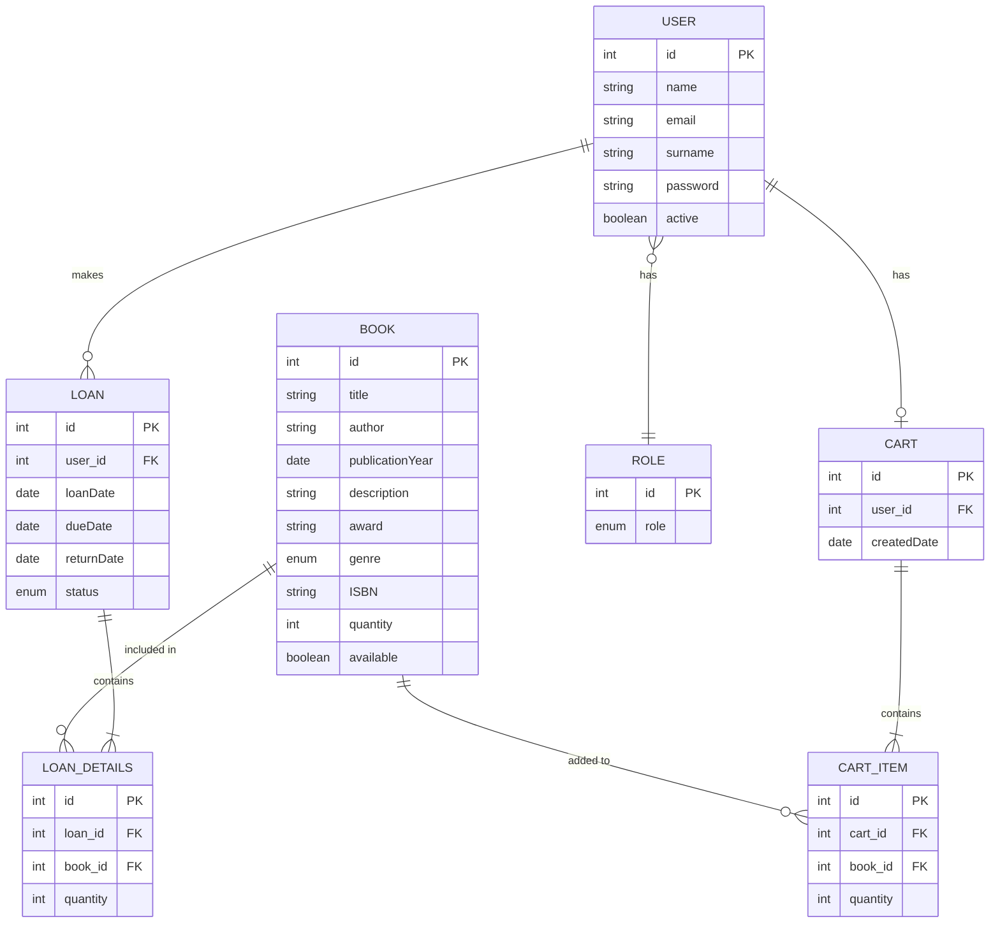

# 📚 Bookshop V5 - RESTful API with Spring Boot

[](https://www.oracle.com/java/technologies/javase/jdk17-archive-downloads.html)
[](https://spring.io/projects/spring-boot)

This is the fifth version of the Bookshop project, evolving into a RESTful API using Spring Boot. It represents a significant advancement from the previous Servlet-based implementation, offering improved scalability, security, and ease of development.

## 🚀 Features

- RESTful API endpoints for comprehensive book and user management
- Enhanced security with JWT-based authentication and authorization
- Improved data access and management using Spring Data JPA
- Advanced error handling with global exception management
- Swagger UI for API documentation and testing
- Modular architecture for improved maintainability and scalability

## 📋 Table of Contents

- [Domain Description](#domain-description)
- [Project Structure](#project-structure)
- [Entity-Relationship Diagram](#entity-relationship-diagram)
- [Prerequisites](#prerequisites)
- [Setup](#setup)
- [Dependency Management](#dependency-management)
- [Authentication and Authorization](#authentication-and-authorization)
- [Security](#security)
- [API Endpoints](#api-endpoints)
- [Error Handling](#error-handling)
- [Monitoring and Logging](#monitoring-and-logging)
- [Testing](#testing)
- [Performance Considerations](#performance-considerations)
- [Deployment](#deployment)
- [Contributing](#contributing)
- [Changelog](#changelog)
- [FAQ](#faq)
- [License](#license)

## 🏢 Domain Description

Bookshop V5 is a comprehensive book management system designed for libraries or bookstores. It allows for efficient management of books, user accounts, loans, and shopping carts. The system supports various operations such as adding new books, managing user roles, processing book loans, and handling return processes.

## 🏗 Project Structure

```
src/
├── main/
│   ├── java/org/evpro/bookshopV5/
│   │   ├── config/
│   │   ├── controller/
│   │   ├── exception/
│   │   ├── filter/
│   │   ├── model/
│   │   │   └── DTO/
│   │   ├── repository/
│   │   ├── service/
│   │   └── utils/
│   └── resources/
│       └── application.properties
└── test/
    └── java/org/evpro/bookshopV5/
```

## 📊 Entity-Relationship Diagram

Here's a simplified Entity-Relationship diagram of the Bookshop V5 system:




This diagram shows the main entities (User, Book, Cart, Loan) and their relationships.

## 🛠 Prerequisites

- Java JDK 17 or higher
- Maven 3.6+
- MySQL Server 8.0+
- Git (for version control)

## 🚀 Setup

1. Clone the repository:
   ```
   git clone https://github.com/yourusername/bookshop-v5.git
   ```
2. Navigate to the project directory:
   ```
   cd bookshop-v5
   ```
3. Create a MySQL database named `bookshop_db_v5`
4. Update `src/main/resources/application.properties` with your MySQL credentials
5. Build the project:
   ```
   mvn clean install
   ```
6. Run the application:
   ```
   mvn spring-boot:run
   ```

## 📦 Dependency Management

Bookshop V5 uses Maven for dependency management. The `pom.xml` file in the project root defines all necessary dependencies.

To manage project dependencies:

1. Ensure Maven is installed on your system.
2. To download dependencies and compile the project, run:
   ```
   mvn clean install
   ```
3. To check for dependency updates:
   ```
   mvn versions:display-dependency-updates
   ```
4. To update dependencies, manually edit versions in `pom.xml`, then run `mvn clean install` again.

Regularly check for dependency updates to keep the project secure and up-to-date.

## 🔐 Authentication and Authorization

- JWT-based authentication
- Role-based access control (USER and ADMIN roles)
- Stateless authentication for improved scalability

## 🛡 Security

Security in Bookshop V5 is primarily implemented through Spring Security and JWT (JSON Web Tokens).

### JWT Authentication

1. JWT is used for stateless session management.
2. JWT configuration is in `application.properties`:
   ```
   application.security.jwt-secret-key=your_secret_key_here
   application.security.jwt-expired-access-token=86400000
   application.security.jwt-expired-refresh-token=172800000
   ```
3. The `JwtUtils` class handles token creation and validation.

### CORS Configuration

CORS (Cross-Origin Resource Sharing) is configured in `WebSecurityConfig.java`. Ensure proper configuration of allowed origins for cross-origin requests.

### Endpoint Protection

Endpoints are protected using annotations like `@PreAuthorize` in controllers, specifying required roles for each endpoint.

### Security Best Practices

- Keep security dependencies up-to-date
- Use HTTPS in production
- Implement rate limiting to prevent brute-force attacks
- Conduct regular security audits

## 🛣 Swagger for Testing API Endpoints

### How to start
To testing the API Endpoints you can connect to the Swagger URL:
http://localhost:8080/swagger-ui/index.html#/

If you use my DbInitializer, you can sign in with these credentials:


**ADMIN:** This access give you possibility to test all application functions.
```json
{
"email": "admin@bookshop.com",
"password": "adminPass123!?"
}
```

**USER:** This access give you possibility to test only user functions of application.
```json
{
"email": "john@example.com",
"password": "user-Pass123*"
}
```

After sign in with correct credential, you must copy the `access_token` that you find in the `SuccessResponse`, click on the top of page in ` Authorize` and paste the content in `Value:`.
If the token is correct, now you can test the entire application functions on Swagger.

You can generate Swagger api-docs here: http://localhost:8080/v3/api-docs

## 🚦 Error Handling

- Global exception handling for consistent error responses
- Custom exceptions for specific error scenarios
- Detailed error messages and appropriate HTTP status codes

## 📊 Monitoring and Logging

Bookshop V5 uses SLF4J with Logback for logging. Logging configuration is in `logback-spring.xml`.

### Logging Configuration

- Development and test environments: Logs are written to both console and file.
- Production environment: Logs are primarily written to files with rotation.

### Log Levels

- INFO: General application flow
- ERROR: Unexpected errors and exceptions
- DEBUG: Detailed information for debugging (development only)

### Monitoring

- Consider integrating with monitoring tools like Prometheus and Grafana for production environments.
- Implement health check endpoints for system status monitoring.

## 🧪 Testing

Run tests using:
```
mvn test
```

Consider implementing:
- Unit tests for service and utility classes
- Integration tests for repository classes
- End-to-end tests for API endpoints

## 🚀 Performance Considerations

- Implement caching mechanisms for frequently accessed data
- Optimize database queries and indexing
- Consider using connection pooling for database connections
- Implement pagination for large data sets in API responses

## 🌐 Deployment

For production deployment:

1. Build the project:
   ```
   mvn clean package
   ```
2. The built JAR file will be in the `target/` directory
3. Deploy the JAR file to your production server
4. Ensure proper production configurations (database, security, etc.)
5. Run the application:
   ```
   java -jar bookshop-v5.jar
   ```

Consider using containerization (e.g., Docker) for easier deployment and scaling.

## 🤝 Contributing

Contributions are welcome! Please follow these steps:

1. Fork the repository
2. Create a new branch for your feature
3. Commit your changes
4. Push to your branch
5. Create a Pull Request

Please ensure your code follows the existing structure, includes appropriate tests, and adheres to the project's coding standards.

## 📜 Changelog

- v5.0.0 (2023-10-01): Initial release of Bookshop V5
    - Migrated to Spring Boot
    - Implemented JWT authentication
    - Added comprehensive API documentation with Swagger

## ❓ FAQ

Q: How do I reset a user's password?
A: Use the admin endpoint `/api/v1/users/{userId}/reset-password`.

Q: Can I use a different database?
A: Yes, update the database configuration in `application.properties` and include the appropriate JDBC driver in `pom.xml`.
