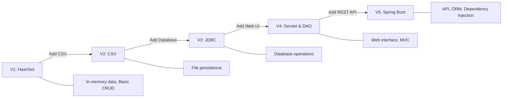

# 📚 Bookshop Evolution Project

[](https://www.oracle.com/java/technologies/javase/jdk17-archive-downloads.html)
[](LICENSE)

This project demonstrates the evolution of a Bookshop application through different implementations, each with a unique approach to data management and system architecture.

## 📋 Table of Content

1. [V1 - Basic management with HashSet](#v1---basic-management-with-hashset)
2. [V2 - Reading and writing to CSV file](#v2---reading-and-writing-to-csv-file)
3. [V3 - Database integration with JDBC](#v3---database-integration-with-jdbc)
4. [V4 - Servlet implementation and DAO pattern](#v4---servlet-implementation-and-dao-pattern)
5. [V5 - RESTful API with Spring Boot](#v5---restful-api-with-spring-boot)


## Project Evolution




## 📚 Main Features

### 1. Book Catalog Management
- Add, edit, and remove books from the catalog
- Search books by title, author, or ISBN
- View detailed book information
- Track book availability and quantity

### 2. User Management
- User registration and authentication
- User roles (e.g., Admin, Librarian, Member)
- User profile management
- Password reset functionality

### 3. Book Lending System
- Check out books to users
- Track due dates and overdue books
- Implement reservation system for popular books
- Generate lending reports and statistics

### 4. Advanced Features (varies by version)
- Data persistence (CSV, Database)
- Web interface for easy access
- RESTful API for integration with other systems
- Scalable architecture for growing libraries

## 🛠 Technologies Used

<table>
  <tr>
    <th>Category</th>
    <th>Technologies</th>
  </tr>
  <tr>
    <td>Backend</td>
    <td>
      
      
      
      
      
    </td>
  </tr>
  <tr>
    <td>Database</td>
    <td>
      
      
    </td>
  </tr>
  <tr>
    <td>Testing</td>
    <td>
      
      
    </td>
  </tr>
</table>


## 🚀 Quick Start

```bash
git clone https://github.com/saraobialero/Java17-ApacheTomcat-SpringBoot-Java_Evolution_Project.git
cd bookshop-evolution
git checkout v1-hashset  # or any other version you want to try
# Follow the README instructions in the specific branch
```

## 📸 Project Versions 

### [V1 - Basic management with HashSet](https://github.com/saraobialero/Java17-ApacheTomcat-SpringBoot-Java_Evolution_Project/tree/v1-hashset)
Basic implementation of the bookshop using HashSet for in-memory data management.

```
src/
├── main/
│   ├── java/org/evpro/bookshopV1/
│   │    ├── Book
│   │    ├── BookException
│   │    └── Bookshop
└──  test/java/         
```

### [V2 - Reading and writing to CSV file](https://github.com/saraobialero/Java17-ApacheTomcat-SpringBoot-Java_Evolution_Project/tree/v2-io)
Evolution that introduces data persistence using CSV files.
```
src/
├── main/
│   ├── java/org/evpro/bookshopV2/
│   │    ├── Book
│   │    ├── BookException
│   │    ├── Bookshop
│   │    └── FileException
│   └── resources/
│       └── BookList.csv
└──  test/java/
```

### [V3 - Database integration with JDBC](https://github.com/saraobialero/Java17-ApacheTomcat-SpringBoot-Java_Evolution_Project/tree/v3-jdbc)
Implementation that uses JDBC for connection and data management with MySQL database.
```
src/
├── main/
│   ├── java/org/evpro/bookshopV3/
│   │           ├── db/
│   │           │   └── DatabaseManager
│   │           ├── exception/
│   │           │   ├── BookException
│   │           │   ├── DataBaseException
│   │           │   └── ErrorResponse
│   │           └──  model/
│   │                ├── Book
│   │                ├── Bookshop
│   │                └── PublicBookView
│   │         
│   └── resources/
│       ├── data.sql
│       ├── database.properties
│       ├── logback.xml
│       └── schema.sql
└──  test/java/
                    
```

### [V4 - Servlet implementation and DAO pattern](https://github.com/saraobialero/Java17-ApacheTomcat-SpringBoot-Java_Evolution_Project/tree/v4-servlet)
Introduction of the MVC pattern with Servlets and implementation of the DAO pattern for data access.
```
src/
├── main/
│   ├── java/org/evpro/bookshopV4/
│   │           ├── DAO/
│   │           │   └── implementation/
│   │           ├── exception/
│   │           ├── filter/
│   │           ├── model/
│   │           │   ├── requests/
│   │           │   └── enums/
│   │           ├──service/
│   │           │   ├── functionality/
│   │           ├── servlet/
│   │           │   ├── listener/
│   │           └── utilities/
│   ├── resources/
│   │   └── database.properties
│   └── webapp/
│       ├── WEB-INF/
│       │   └── web.xml
└──  test/java/
```

### [V5 - RESTful API with Spring Boot](https://github.com/saraobialero/Java17-ApacheTomcat-SpringBoot-Java_Evolution_Project/tree/v5-springboot)
Implementation of RESTful API using the Spring Boot framework.
```
src/
├── main/
│   ├── java/org/evpro/bookshopV5/
│   │   ├── config/
│   │   ├── controller/
│   │   ├── exception/
│   │   ├── filter/
│   │   ├── model/
│   │   │   └── DTO/
│   │   │       └── request/
│   │   │       └── response/
│   │   ├── repository/
│   │   ├── service/
│   │   └── utils/
│   └── resources/
│       └── application.properties
└── test/
    └── java/org/evpro/bookshopV5/
```


## 📊 Comparison

| Feature          | V1: HashSet | V2: CSV | V3: JDBC | V4: Servlet | V5: Spring Boot |
|------------------|-------------|---------|----------|-------------|-----------------|
| Data Persistence |     ❌      |    ✅   |    ✅    |     ✅      |       ✅        |
| Web Interface    |     ❌      |    ❌   |    ❌    |     ✅      |       ✅        |
| API              |     ❌      |    ❌   |    ❌    |     ✅      |       ✅        |
| Scalability      |     Low     |   Low   | Moderate |   Moderate  |      High       |
| Complexity       |     Low     |   Low   | Moderate |    High     |    Moderate     |


## ⚙️ Testing

Each version includes a test suite to verify the correct functionality of the implemented features.

## 📚 Learning Outcomes
- Evolution of a simple application into a full-fledged web service
- Different data persistence strategies
- Transition from monolithic to layered architecture
- Implementation of design patterns (DAO, MVC)
- Integration of frameworks and libraries
- Best practices in Java development across different paradigms

## 🫶 Contributing

Contributions are welcome! Please read the contribution guidelines before getting started.

## 📎 License

This project is distributed under the [MIT License](LICENSE).